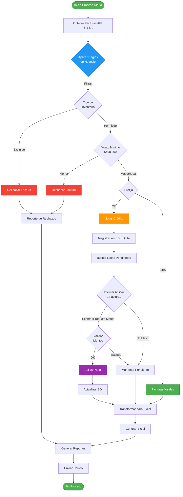
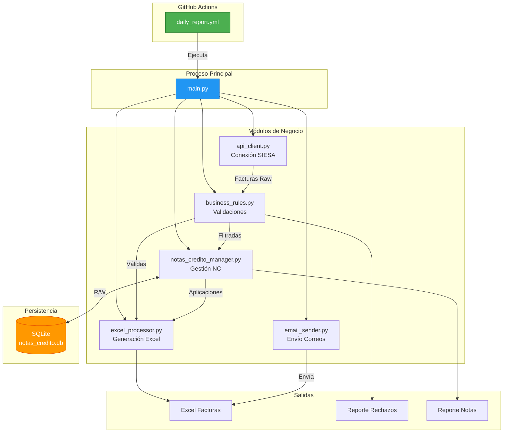
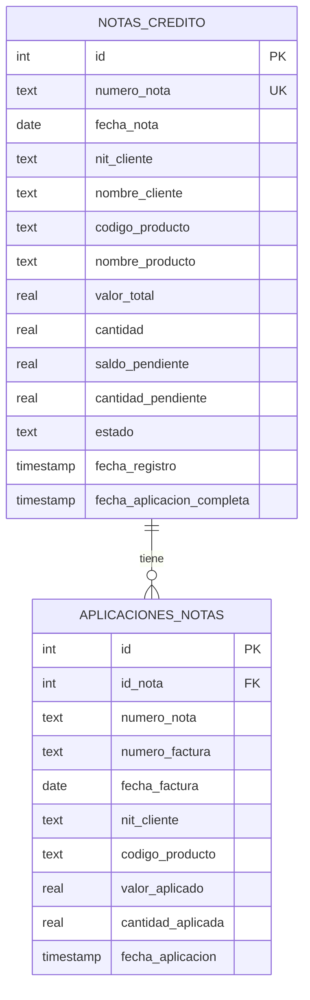
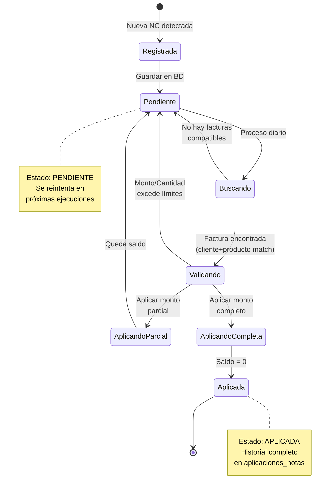
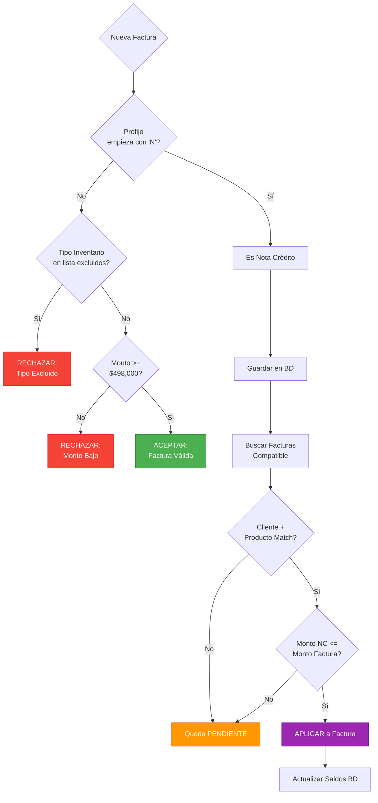
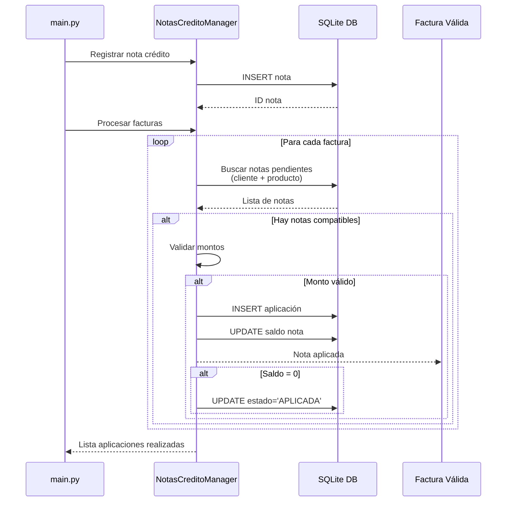

# Arquitectura del Sistema

## Diagrama de Flujo de Procesamiento

## Diagrama de Componentes

## Diagrama de Base de Datos

## Flujo de Notas Crédito

## Reglas de Negocio - Decisión

## Secuencia de Aplicación de Nota Crédito

---

## Visualización de Archivos

Para ver estos diagramas:
1. Visualizador en GitHub (automático al ver este archivo)
2. VS Code con extensión "Markdown Preview Mermaid Support"
3. Sitio web: https://mermaid.live/

---

*Diagramas generados con Mermaid*
*Compatible con GitHub, GitLab, Notion, Confluence, etc.*
